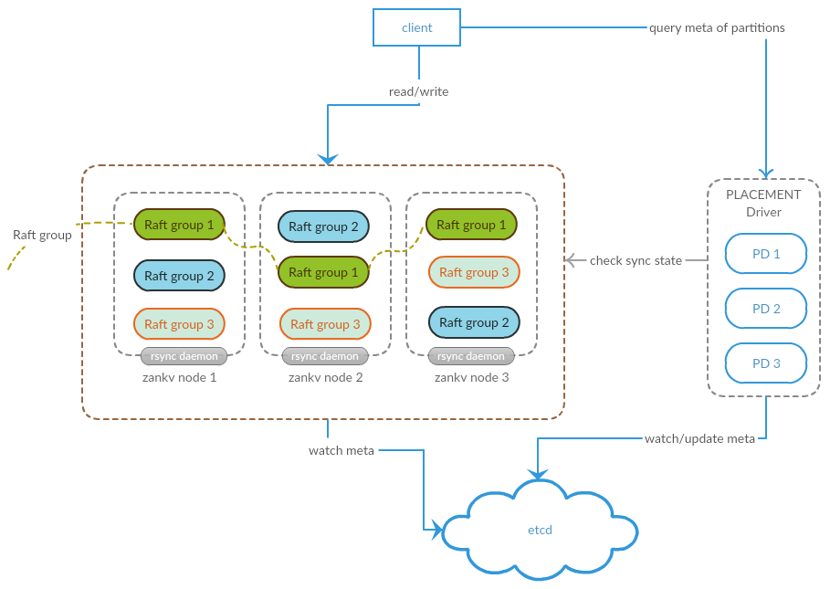

# ZanRedisDB

    
 

## What is ZanRedisDB
ZanRedisDB is a distributed redis cluster with strong consistency.
- Compatible with redis protocol: most redis command is supported in ZanRedisDB, so you can replace Redis with ZanRedisDB and get a more powerful cluster with unlimited data.
- Namespace and set supported: You can use the namespace and set as prefix to isolate different data to make operation more easily. 
- Strong consistence and persistence: Use raft and rocksdb to make sure all the data have the consistence replication and persistent on stable storage.
- Scalability: You can easily increase the cluster capacity just by adding more machines.
- Multi-DC support: multi data centers deployment can be supported with rackaware feature.

## Build

Install the compress library
<pre>
yum install snappy-devel (for CentOS)
apt-get install libsnappy1 libsnappy-dev (for Debian/Ubuntu)
brew install snappy (for Mac)
</pre>

Build the rocksdb 
<pre>
git clone https://github.com/absolute8511/rocksdb.git
cd rocksdb
USE_SSE=1 make static_lib
</pre>

Install the dependency:
<pre>
CGO_CFLAGS="-I/path/to/rocksdb/include" CGO_LDFLAGS="-L/path/to/rocksdb -lrocksdb -lstdc++ -lm -lsnappy -lrt" go get github.com/absolute8511/gorocksdb

CGO_CFLAGS="-I/path/to/rocksdb/include" CGO_LDFLAGS="-L/path/to/rocksdb -lrocksdb -lstdc++ -lm -lsnappy" go get github.com/absolute8511/gorocksdb (for MacOS)
</pre>

use the `gpm` to install other dependencies
<pre>
wget https://raw.githubusercontent.com/pote/gpm/v1.4.0/bin/gpm && chmod +x gpm && sudo mv gpm /usr/local/bin
gpm get
</pre>

Build zankv and placedriver from the source (only support go version 1.8+, gcc 4.9+ or xcode-command-line-tools on Mac):
<pre>
make
</pre>

If you want package the binary release run the scripts
<pre>
./pre-dist.sh
./dist.sh
</pre>

## Deploy

 * Deploy the rsync daemon which is needed on all server node to transfer the snapshot data for raft
 * Deploy etcd cluster which is needed for the meta data for the namespaces
 * Deploy the placedriver which is used for data placement: `placedriver -config=/path/to/config`
 * Deploy the zankv for data storage server `zankv -config=/path/to/config`

## API
placedriver has several HTTP APIs to manager the namespace
 * list the namespace: `GET /namespaces`
 * list the data nodes: `GET /datanodes`
 * list the placedriver nodes: `GET /listpd`
 * query the namespace meta info: `GET /query/namespace_name`
 * create the namespace (handle only by leader) : `POST /cluster/namespace/create?namespace=test_p16&partition_num=16&replicator=3`
 * delete the namespace (handle only by leader): `POST /cluster/namespace/delete?namespace=test_p16&partition=**`

storage server HTTP APIs for stats:
 * namespace stats : `GET /stats`
 * namespace raft internal stats : `GET /raft/stats`
 * optimize the data storage : `POST /kv/optimize`
 * get the raft leader of the namespace partition: `GET /cluster/leader/namespace-partition`

storage server also support the redis apis for read/write :
 * KV:
 * Hash Set:
 * List:
 * Sorted Set:
 * ZSet:

## Client
Golang client SDK : [client-sdk] , a redis proxy can be deployed 
based on this golang sdk if you want use the redis client in other language.

## Architechture

## Roadmap
* Redis data structures
  - [x] KV
  - [x] Hash
  - [x] List
  - [x] Set
  - [x] Sorted Set
  - [x] GeoHash
  - [x] Expires
  - [x] HyperLogLog
  - [x] JSON
* Distributed system
  - [x] Raft based replication
  - [x] Partitions
  - [x] Auto balance and migrate
  - [x] Support namespace
  - [x] High available
  - [x] Distributed scan on table
  - [x] Rackaware deployment used for across data center deployment
* Searchable and Indexing
  - [ ] Secondary index support on Hash fields
  - [ ] Secondary index support for json kv
  - [ ] Full text search support
* Operation
  - [x] Backup and restore for cluster
  - [ ] More stats for read/write performance and errors.
* Client 
  - [x] High available for redis commands (Retry on fail)
  - [ ] Extand redis commands to support index and search
  - [x] Extand redis commands for advance scan
* Others (maybe)
  - [ ] Support configure for Column storage friendly for OLAP
  - [ ] BoltDB as storage engine (read/range optimize)
  - [ ] Lua scripts support
  - [ ] Support export data to other systems

[client-sdk]: https://github.com/absolute8511/go-zanredisdb
