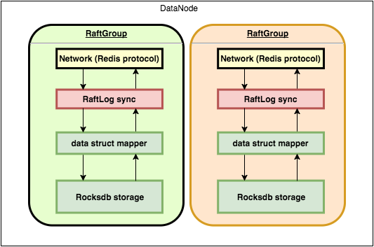
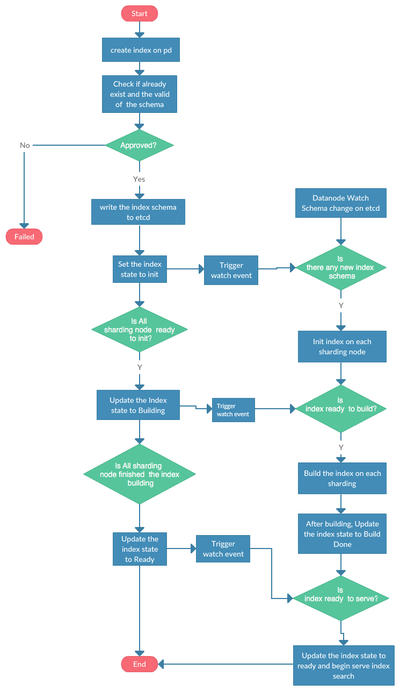

# Design

## 整体架构

### 集群架构

整个集群由placedriver + 数据节点datanode + etcd + rsync组成. 各个节点的角色如下:

PD node: 负责数据分布和数据均衡, 协调集群里面所有的zankv node节点, 将元数据写入etcd

datanode: 负责存储具体的数据

etcd: 负责存储元数据, 数据分布情况以及其他用于协调的元数据

rsync: 用于传输snapshot备份文件

### 数据节点架构

数据节点datanode有多个不同的分区组成, 每个分区是一个raftgroup. 每个分区由协议层redis, 日志同步层raftlog, 数据映射层和数据存储层构成.

redis协议层: 负责读取和解析客户端的redis命令, 并提交到raft层同步

raft日志同步层: 负责raft副本同步, 保证数据一致性

数据映射层: 负责将redis数据结构编码映射成db层的kv形式, 保证符合redis的数据结构语意

数据存储层: 负责封装rocksdb的kv操作.

数据节点会往etcd注册节点信息, 并且定时更新, 使得placedriver可以通过etcd感知自己.

### placedriver节点

placedriver负责指定的数据分区的节点分布, 还会在某个数据节点异常时, 自动重新分配数据分布. 总体上负责调度整个集群的数据节点的元数据. placedriver本身并不存储任何数据, 关于数据分布的元数据都是存储在etcd集群, 可以有多个placedriver作为读负载均衡, 多个placedriver通过etcd选举来产生一个master进行数据节点的分配和迁移任务. placedriver节点会watch集群的节点变化来感知整个集群的数据节点变化.

placedriver提供了数据分布查询接口, 供客户端sdk查询对应的数据分区所在节点.

#### 数据分区的分布

#### 数据平衡

## HA流程

### 服务端
- 正常下线时, 当前节点通过raft转移自己节点拥有的分区的leader节点, 自动摘除本机节点
- 新被选举出来的leader自动重新注册到etcd, 每个分区将当前最新的leader信息更新到etcd元数据
- placedriver监控leader节点变化, 一旦触发watch, 则自动从etcd刷新最新的leader返回给客户端
- 如果有客户端读写请求发送到非leader节点上, 服务端会返回特定的集群变更错误. 客户端刷新集群数据后重试

### go-sdk处理
- sdk启动时会启动一个定时lookup线程, 线程会定时的从placedriver服务中查询最新的leader信息, 并缓存到本地
- 读写操作时, 会从当前缓存的节点中找到对应的分区leader连接
- 通过连接发起读写操作时, 如果服务端返回了特定的错误信息, 则判断是否集群发生变更, 如果发生集群变更, 则立即触发查询最新leader信息, 并等待自动重试, 一直等到重试成功或者超过指定的超时时间和次数.
- 定时placedriver服务查询线程会剔除已经摘除的节点连接

## 分布式索引

由于分布式系统中, 一个索引会有多个分片, 为了保证多个分片之间的数据一致性, 需要协调多个分片的索引创建流程. 基本流程如下:

## 跨机房多集群同步

### 单个跨多机房集群模式

### 多个机房内集群同步模式

## 数据过期功能设计

为了满足各种场景下的业务需求，ZanKV设计了多种不同的数据过期策略。在不同的数据过期策略下，ZanKV对数据过期有不同的支持和表现。
目前，ZanKV支持的数据过期策略有：
- 一致性同步过期
- 非一致性本地删除

与redis不同的是，ZanKV只支持秒级的数据过期，不支持pexpire指令(毫秒级别的数据过期)。

### 一致性同步过期

当ZanKV集群的数据过期策略配置为：一致性同步过期时。所有的数据过期操作都由leader发起，通过raft协议进行删除操作。

在实际操作中，过期数据处理逻辑层每间隔1s会调用存储层接口，获取当前已经过期的数据key和类型。为减少集群node间网络交互的次数，逻辑层会对相同类型的key通过一条指令、一次raft交互进行批量删除。

使用该策略时，数据过期删除需要集群节点之间频繁的网络交互，在大量数据过期的情况下，会大大增加网络的负担和leader节点的压力。该策略适用于：过期数据量不大，业务方依赖于数据的TTL进行业务逻辑处理。

但是，在一般情况下，业务方并不会依赖于数据的TTL进行业务逻辑处理。相反的，业务方关注的是，数据需要保持一定的时间(半年、三个月、一周等)，过了保存期，这些数据可以自动失效、删除，即在业务上数据已经没有用了，业务方不会再次访问或者关注这些数据，存储集群可以自行删除数据。在这种情况下，采用非一致性本地删除策略更加的合适。

### 非一致性本地删除

在非一致性本地删除的策略下，数据删除操作由各个集群节点自己进行，删除操作不通过raft协议进行。

具体的：数据删除操作由存储层自动进行，数据处理逻辑层不需要参与。ZanKV集群中的每个节点每间隔5min会扫描一次过期数据，并对扫描出的待删除数据进行本地直接删除。

相比于一致性同步过期策略，该策略具有以下特性：

更大量的数据过期支持。过期数据删除不需要集群节点之间的通信，可以避免在大量数据过期情况下造成的网络和性能处理瓶颈，进而支撑更大量的数据过期服务。
具有更高的数据吞吐量。该策略考虑到用户不关注于具体的TTL时间，优化了存储数据的编码格式，减少了数据存储时的写放大，提供更好的性能支持。
数据过期扫描间隔为5min。保证数据一定不会被提前删除，但是不保证数据删除的实时性，业务方不应该依赖于数据是否还存在进行业务逻辑处理。
用户无法通过TTL指令获取数据生存时间，也不支持Persist指令对过期数据进行持久化。这是为了提高吞吐量，提供更大量的数据过期支持所做的trade off。

### 前缀清理删除

非一致性删除虽然提供了更好的性能, 但是面对非常海量的过期数据时, 依然会产生大量的本地删除操作, 增加底层rocksdb的压力, 为了进一步减少删除过期的影响, 对于具有时效性特点的数据, ZanKV支持按照前缀清理. 这种模式下, 业务方的数据都是时效性的, 比如监控数据或者日志数据, 写入时业务会在key前面加上时间戳前缀. 使用删除API的时候, 指定业务前缀, 可以删除特定时间内的所有数据, 大大提高删除的效率. 前缀删除的API底层使用了rocksdb的DelRange方法, 此方法相比大量Delete操作, 对rocksdb的压力大大减少.